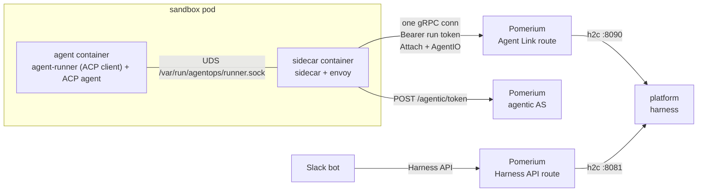

# Run identity

A session's agent acts with a Pomerium-issued, instance-pinned **agentic run
token**. The platform (the `harness` process) creates a run at Pomerium, sealed
to the sandbox pod's attested Kubernetes identity. The interactive user approves
it on Pomerium's consent page, where they also Connect any MCP upstreams. The
sandbox sidecar then exchanges its projected service-account token for the run's
opaque bearer and injects it on loopback egress. The agent container holds no
credential and never learns a run id.

Run identity is the only launch path. The platform does not start without
`AGENTIC_AS_URL`, and it needs the Agent Link route below: the sandbox
authenticates its own control channel with the run token, so there is no
run-less session.

The examples below use the default namespace layout: the platform and the
sandboxes in `agentops-system`, the Slack bot in `agentops-slackbot`. The
platform's Service is `agentops.agentops-system.svc.cluster.local`, its
ServiceAccount is `agentops` (release name `agentops`), and the sandboxes run as
the `sandbox-agent` ServiceAccount.

## Pomerium prerequisites

The agentic authorization server (AS) is Pomerium with `runtime_flags:
{agentic: true, mcp: true}`. Deploy it with:

- **Its own listener, and three routes in front of it.** The AS has no
  authorization of its own — the handler verifies a workload JWT against every
  configured identity provider and runs no policy — so the routes pointing at it
  are what decide who may summon a run, which pods may exchange a token for one,
  and who may approve. It binds a loopback port Pomerium allocates at startup, so
  nothing can reach it any other way; routes name it `pomerium://agentic`:

  ```yaml
  routes:
    # 1. the summoner (the platform): create a run, poll its status
    - from: https://agentic.example.com
      prefix: /agentic/runs
      to: pomerium://agentic
      bearer_token_format: jwt
      identity_providers: [cluster]
      preserve_host_header: true      # else the approval link names the loopback address
      policy:
        allow:
          and:
            - claim/kubernetes.io.namespace: agentops-system
            - claim/kubernetes.io.serviceaccount.name: agentops

    # 2. the sandbox sidecar: exchange its projected token for a run token
    - from: https://agentic.example.com
      path: /agentic/token             # exact path, not a prefix
      to: pomerium://agentic
      bearer_token_format: jwt
      identity_providers: [cluster]
      policy:
        allow:
          and:
            - claim/kubernetes.io.namespace: agentops-system
            - claim/kubernetes.io.serviceaccount.name: sandbox-agent
            - claim/kubernetes.io.pod.uid: { present: true }

    # 3. humans: the consent page (GET renders, POST approves)
    - from: https://agentic.example.com
      path: /agentic/approve
      to: pomerium://agentic
      pass_identity_headers: true      # else every approval 401s
      preserve_host_header: true
      mcp: { client: {} }              # lets a Connect round trip return here
      policy:
        allow:
          and:
            - domain: example.com
  ```

  Three lines there are load-bearing and fail in ways that look like something
  else. Without `preserve_host_header` on the summon route, Envoy rewrites Host
  and the approver is sent a link to Pomerium's own loopback port. Without
  `pass_identity_headers` on the approve route, Envoy strips
  `X-Pomerium-Jwt-Assertion` and every approval answers 401. Without
  `mcp: { client: {} }` there, the Connect round trip to an MCP server's host has
  nowhere valid to return to.
- **A persistent databroker** (for example `postgres`). An in-memory databroker
  loses every run on restart. Run records carry a storage TTL derived from
  `agentic_run_idle_timeout` (default 48h, so 72h) — long enough that a paused
  conversation survives, and refreshed on every token mint so an active run is
  never swept.
- **A cluster identity provider** for verifying projected service-account tokens:

  ```yaml
  identity_providers:
    cluster:
      issuer: "kubernetes:///"          # in-cluster JWKS via Pomerium's own SA
      audiences: ["pomerium-agentic-as"] # == the projected-token audience
      supported_algs: ["RS256"]
  ```

  `issuer: kubernetes:///` needs no apiserver `anonymous-auth` changes — Pomerium
  authenticates discovery/JWKS with its own service-account token.
- **A human IdP that issues refresh tokens** — the approver must hold an upstream
  refresh token for the approval page to succeed, and the AS keeps interactive
  runs alive against the approver's IdP session.

## Route configuration

**A run carries no grant.** What a run token may reach is decided per route and
nowhere else: a route interprets a run token only if it declares the format, and
its policy decides which runs it admits. Nothing on the run's side widens that,
which is why the policy should pin the sealed executor claims (surfaced to PPL
under the literal `act.` prefix) as well as the approver. Every upstream the agent
reaches — the LLM API, each MCP server, any other tool — is one such route:

```yaml
routes:
  # The LLM API. The sidecar sends the run token; the route adds the API key.
  - from: https://anthropic.example.com
    to: https://api.anthropic.com
    bearer_token_format: agentic_run_token
    set_request_headers:
      x-api-key: "<the Anthropic API key>"
    remove_request_headers: [Authorization]   # see "Strip Authorization" below
    policy:
      allow:
        and:
          - claim/act.kubernetes.io.serviceaccount.name: sandbox-agent

  # A plain tool route reached via the run token.
  - from: https://tool.example.com
    to: http://tool.default.svc
    bearer_token_format: agentic_run_token
    policy:
      allow:
        and:
          - claim/act.kubernetes.io.pod.uid: { present: true }

  # An MCP route. Being an MCP route is NOT enough on its own — without the
  # declaration an approved run token would reach every MCP route in the
  # deployment and could spend the approver's connected upstream credentials.
  - from: https://gke.example.com
    to: http://gke-mcp.default.svc
    bearer_token_format: agentic_run_token
    mcp: { server: {} }
    policy:
      allow:
        and:
          - claim/act.kubernetes.io.pod.uid: { present: true }
```

## Platform configuration

| Env | Required | Default | Meaning |
| --- | --- | --- | --- |
| `AGENTIC_AS_URL` | yes | — | Public `https` base URL of the host that carries the AS's three `/agentic/*` routes. |
| `AGENTIC_AS_DIAL_ADDRESS` | no | — | In-cluster address to dial while Host/SNI stay public. Also the default dial address for both assertion JWKS fetches. |
| `AGENTIC_TOKEN_FILE` | no | `/var/run/agentic/token` | Projected workload token presented as the AS bearer. |
| `AGENTIC_CA_FILE` | no | system roots | PEM CA bundle trusted for the AS TLS cert. Also the default CA for both assertion JWKS fetches. |
| `AGENTIC_RUN_TTL` | no | `15m` | Pre-approval window for created runs. The platform waits this long plus 2 minutes for the sandbox to attach. |

The platform chart always mounts the projected token at
`/var/run/agentic/token`. Its audience is `config.agentic.audience` (see
[`deploy/charts/agentops/values.yaml`](../deploy/charts/agentops/values.yaml)):

```yaml
config:
  agentic:
    asURL: https://agentic.example.com
    audience: pomerium-agentic-as   # must equal the cluster identity provider's audience
```

## Sandbox pod contract

The agentops Component ([`deploy/components/agentops`](../deploy/components/agentops/README.md))
applies this contract to every SandboxTemplate annotated
`agents.pomerium.com/inject: "true"`:

- `serviceAccountName: sandbox-agent` and `automountServiceAccountToken: false` —
  the agent container is credential-free;
- a projected `serviceAccountToken` volume (audience `pomerium-agentic-as`,
  `expirationSeconds: 600`) mounted into the **sidecar container only**, at
  `/var/run/agentic`;
- `dnsPolicy: ClusterFirst` (agent-sandbox otherwise rewrites pod DNS, so the
  sidecar cannot resolve the in-cluster Pomerium Service);
- the runner as the agent container's command, the `sidecar` container running
  `sidecar serve user-identity`, and a network policy that admits DNS and
  Pomerium and nothing else. The policy covers the whole pod, init containers
  included, so a template with a `git-init` checkout adds an egress rule for its
  git host, and the agent container can then reach that host too (see
  [`deploy/examples/git-egress.yaml`](../deploy/examples/git-egress.yaml)).

A per-environment patch sets the hosts the sidecar dials —
`SIDECAR_AGENTIC_AS_URL`, `SIDECAR_HARNESS_URL` and
`SIDECAR_HTTP_ANTHROPIC_UPSTREAM_URL` — and in-cluster dial addresses
(`SIDECAR_AGENTIC_AS_DIAL_ADDRESS`, `SIDECAR_HARNESS_DIAL_ADDRESS`,
`SIDECAR_HTTP_ANTHROPIC_DIAL_ADDRESS`) and a private CA
(`SIDECAR_AGENTIC_CA_FILE`), as
[`deploy/examples/endpoints.yaml`](../deploy/examples/endpoints.yaml) does.
A dial address can be left out only if the public host, resolved inside the
pod, reaches a Pomerium pod that the network policy admits. Every dial target,
an MCP server's `dialAddress` included, must be such a pod.
`SIDECAR_AGENTIC_ROTATION_INTERVAL` sets how often the sidecar exchanges its
token again (default 10m, and never more than a sixth of the run token's
lifetime).

The LLM endpoint is a Pomerium route like any other: the component sets
`SIDECAR_HTTP_ANTHROPIC_INJECT_RUN_TOKEN`, so the sidecar sends the run token,
and the route adds the API key.

The sidecar's `SIDECAR_HTTP_*` endpoints are only *partly* template-authored: the
platform sends the agent template's MCP servers as further endpoints on the
attach stream (see below). Each of them sends the run token as its bearer, so
every `requiredMCPServers` URL must be a Pomerium route the operator controls,
never a third-party host. Names and listen ports must not collide with the
template's own — the sidecar refuses a configuration where two fold together and
reports `config_failed`.

## Workload mode

The sidecar also runs without the platform: `sidecar serve workload-identity`
makes it a standalone egress proxy for any pod. There is no platform, no run and
no Agent Link. The pod's own projected service-account token is the credential,
injected as it is on every `INJECT_RUN_TOKEN` endpoint, and Pomerium verifies
that JWT itself, the way it verifies the platform's token on the summon route.

| | Run mode (`serve user-identity`) | Workload mode (`serve workload-identity`) |
| --- | --- | --- |
| Identity on egress | a run: approved by a human, sealed to this pod | the pod's service account |
| Credential | run token from `/agentic/token` | the projected JWT, no exchange |
| Needs | the platform, the AS, the Agent Link route, the runner | only Pomerium routes |
| Endpoints | template env plus per-session ones from the platform | template env only (`SIDECAR_HTTP_*`) |
| Route format | `bearer_token_format: agentic_run_token` | `bearer_token_format: jwt` |

Use **run mode** when what the agent may do depends on who asked: per-user,
consented runs, where the approver is who Pomerium authorizes. Use **workload
mode** when the answer is the same whoever asked: a service identity, an unattended
job, or one identity per deployed agent. Policy then names the service account,
so anyone who can run a pod as that service account gets its egress. Decide who
may do that with RBAC.

### Sidecar configuration

| Env | Default | Meaning |
| --- | --- | --- |
| `SIDECAR_WORKLOAD_TOKEN_FILE` | `/var/run/egress/token` | The projected token to inject. Re-read before it expires, so kubelet rotation is picked up. |
| `SIDECAR_WORKLOAD_AUDIENCE` | `pomerium-egress` | The `aud` the token must carry. A token without it is refused. |
| `SIDECAR_WORKLOAD_CA_FILE` | system roots | CA for the Pomerium routes' TLS. |

Endpoints are the usual `SIDECAR_HTTP_<NAME>_*` variables, and at least one is
required. Each identity reads only its own env, and refuses to start when the
variables that decide the other one are set: `workload-identity` refuses
`SIDECAR_HARNESS_URL` and `SIDECAR_AGENTIC_AS_URL`, and `user-identity` refuses
`SIDECAR_WORKLOAD_TOKEN_FILE` and `SIDECAR_WORKLOAD_AUDIENCE`. It also refuses
when the audience is the agentic AS's. The sidecar exits
with an error if envoy dies, or if the token file is missing, unreadable, carries
the wrong audience, or has expired because the kubelet stopped rotating it.

**Keep the audiences apart.** The egress token needs its own projected volume and
audience. Pomerium accepts a JWT on any route whose identity provider lists its
audience, so a token with `pomerium-agentic-as` would be accepted at
`/agentic/token`, and an AS token would be accepted on egress routes. The token is
mounted into the sidecar only, and the SDS file envoy reads it from is on the
sidecar's own filesystem, so the app container never holds it. Keep the network
policy as well: DNS and Pomerium only. Without it the app can go around the
sidecar.

The Component's `agents.pomerium.com/inject: "workload"` annotation sets all of
this up on a SandboxTemplate, Deployment, StatefulSet, DaemonSet or Job (see
[its README](../deploy/components/agentops/README.md#workload-mode)).

### Pomerium routes

```yaml
identity_providers:
  cluster-egress:
    issuer: "kubernetes:///"
    audiences: ["pomerium-egress"]      # == SIDECAR_WORKLOAD_AUDIENCE, never pomerium-agentic-as
    supported_algs: ["RS256"]

routes:
  - from: https://anthropic.example.com
    to: https://api.anthropic.com
    bearer_token_format: jwt
    identity_providers: [cluster-egress]
    set_request_headers:
      x-api-key: "<the Anthropic API key>"
    remove_request_headers: [Authorization]   # see below
    policy:
      allow:
        and:
          - claim/kubernetes.io.namespace: team-a
          - claim/kubernetes.io.serviceaccount.name: nightly-report
```

**Strip `Authorization` on routes that don't overwrite it.** Pomerium does not
remove a `Bearer` credential it has verified: the pod's JWT is forwarded to the
upstream unless the route removes or replaces it. The only exceptions are MCP
server routes, which strip it. Where the upstream key goes in another header, as
with `x-api-key` above, add `remove_request_headers: [Authorization]`, or
api.anthropic.com receives a token that Pomerium accepts on every route listing
this audience. Removal happens when the request is forwarded, after authorization
has already read the bearer. Where the upstream key is itself `Authorization`,
`set_request_headers: {Authorization: ...}` overwrites the JWT. Run tokens are
handled the same way, so this applies to `agentic_run_token` routes too.

## Agent Link

The sandbox and the platform meet on the **Agent Link**, a gRPC service the
platform serves on port 8090. The **sandbox dials out** to it through a Pomerium
route authenticated by the run token; nothing connects into the pod. The
platform is the party `agentlink.proto` calls the manager.



Two bidirectional streams share that one connection. **Attach** is the control
channel: liveness plus lifecycle directives (spawn the agent, shut down).
**AgentIO** carries the agent session: numbered agent events from the runner to
the platform, and prompts, permission decisions and acks back. The platform
drives the sandbox by sending directives back on streams the sidecar opened — the
sidecar is the gRPC client for both, and passes AgentIO frames to the runner
unchanged.

### The route

```yaml
- from: https://harness.example.com     # per-environment host
  to: h2c://agentops.agentops-system.svc.cluster.local:8090
  bearer_token_format: agentic_run_token
  timeout: 0s                     # both timers off: see below
  idle_timeout: 0s
  pass_identity_headers: true     # forwards X-Pomerium-Jwt-Assertion upstream
  policy:
    allow:
      and:
        - claim/act.kubernetes.io.namespace: agentops-system
        - claim/act.kubernetes.io.serviceaccount.name: sandbox-agent
```

Zeroing both timers is what lets a session sit idle for hours. **Do not** use
`allow_websockets: true` for this, although it zeroes the same two: it also
forces the upstream to HTTP/1.1 (pomerium #2388,
`getUpstreamProtocolForPolicy`), and a Go gRPC server speaks only h2, so every
stream dies with `502 upstream_reset_before_response_started{protocol_error}` while
policy and the run token look perfectly fine. `timeout` and `idle_timeout` are
honored ahead of that side-effect and leave the upstream on h2c.

Reaching PPL at all already implies a live, approved, non-revoked run: the run
session is resolved — uncached, so revocation is immediate — before policy runs.
That this route accepts a run token at all is its own `bearer_token_format`
declaration above.

The claims that policy matches, and that the Agent Link authorizes attaches from, only
exist in the assertion because a **global** `jwt_claims_headers` lists them:

```yaml
jwt_claims_headers:
  run_id: run_id
  act.kubernetes.io.namespace: act.kubernetes.io.namespace
  act.kubernetes.io.serviceaccount.name: act.kubernetes.io.serviceaccount.name
  act.kubernetes.io.pod.name: act.kubernetes.io.pod.name
  act.kubernetes.io.pod.uid: act.kubernetes.io.pod.uid
```

Those are literal keys — the dots are part of the key, not nesting. Being global,
other routes' upstreams also receive `X-Pomerium-Claim-*` headers for them;
nothing in this deployment interprets those. A missing entry shows up as the Agent
Link refusing every attach with `assertion carries no run_id` or `assertion pod
identity incomplete`.

### Three ordering invariants

1. **Expect precedes approval.** The platform registers the Agent Link expectation
   immediately after `CreateRun`, before a human can possibly click approve. A
   sandbox that minted its token the instant approval landed would otherwise dial in
   to an absent expectation, be told `NOT_FOUND`, and treat that as terminal.
2. **Attach follows the token.** The sidecar cannot attach before it holds a run
   token, and cannot hold one before the run is approved. Pre-approval it simply
   polls `/agentic/token` and gets `authorization_pending`; there is no channel to
   the platform at all, and nothing for one to do — the sandbox has no credentials
   yet.
3. **The agent follows READY.** `HelloAck` carries this session's endpoints, so the
   sidecar starts envoy after attaching, not before. The platform holds the
   `SpawnAgent` directive until the sidecar reports `STATE_READY`; spawning on the
   attach alone would hand the agent loopback ports with nothing behind them.

### Where a sandbox's configuration comes from

The split is forced by the warm pool. A pre-warmed pod is built from its
SandboxTemplate long before any `SandboxClaim` exists, so anything session-shaped
has to arrive later — and a claim that carries `Env` (or `VolumeClaimTemplates`)
makes agent-sandbox skip pool adoption altogether, costing every launch a full cold
start.

| | Where | Examples |
|---|---|---|
| Same for every session the template serves | SandboxTemplate env | `SIDECAR_HARNESS_URL`, `SIDECAR_AGENTIC_AS_URL`, the LLM route endpoint |
| This session's endpoints | `ManagerHelloAck.config` on the attach stream | this template's MCP servers, each with the run token injected |
| This session's agent | `SpawnAgent.session` | the working directory, the MCP servers as loopback URLs, the system prompt, session config options, the ACP session to resume |
| Neither | — | the `SandboxClaim`, which carries only its warm-pool ref |

The platform sets the sandbox's deadline as a lease on the Sandbox
(`spec.shutdownTime`, `SANDBOX_LEASE`, default 1h) and extends it while the
session is in use.

The sidecar unions the two endpoint sets and refuses the configuration if a name
or listen port appears in both: whichever one lost would send the agent's
requests to the wrong upstream.

`SIDECAR_HARNESS_URL` and the platform's `HARNESS_EXTERNAL_URL` must name the same
route. That route's own policy is what admits a sandbox's attach, so a sandbox
dialing anywhere else is denied — and since the platform cannot see the pod's env,
it cannot check this for you. It logs the route while it waits for the attach.

### Identity

The Agent Link takes identity ONLY from the verified `X-Pomerium-Jwt-Assertion`: the
`run_id` and the four flattened `act.kubernetes.io.*` pod claims. Both `iss` and
`aud` are the route host (Pomerium mints them from the request hostname). Those
claims must equal the executor seal the run was created with, which the platform
read from the API server when it prepared the sandbox. Messages carry no identity.

A seal mismatch, or a missing or invalid assertion, is rejected with
`FAILED_PRECONDITION`, never `PERMISSION_DENIED`. The distinction is
load-bearing: the sidecar answers `PERMISSION_DENIED` by re-minting its token and
retrying (at most three times), because that code means Pomerium's ext_authz
denied the bearer. Conflating the two would turn a rejected attack into a
token-refresh loop.

### Failure semantics

| Event | Sidecar | Platform | Session |
|---|---|---|---|
| Tunnel drop (any cause) | keeps agent + envoy running, redials with backoff, reopens AgentIO | grace timer (`HARNESS_ATTACH_GRACE`, 2m) | survives if re-attach lands inside the grace window; the runner replays the events the platform did not ack |
| Platform restart | redials; gets `UNAVAILABLE` until the startup reconcile finishes | adopts each running session whose run, pod, stream and ACP session are recorded, and waits `HARNESS_ATTACH_GRACE` for its sandbox; ends every other non-suspended session as interrupted and deletes its sandbox | survives if adopted; otherwise ended |
| Unknown run (`NOT_FOUND`) | stops the agent and envoy, then idles until the pod is deleted | — | ended |
| Agent process exits | the runner sends `AgentExited` as the last event | ends the session and deletes the sandbox | ended, the client told |
| Envoy dies | reports `STATE_ERROR{envoy_exited}`, stops the agent | ends the session | ended |
| Run revoked or expired | next `/agentic/token` exchange gets 403: reports `STATE_ERROR{token_terminal:…}`, stops the agent | per-session `GetRun` poll (60s) also notices | ended by whichever notices first |
| Sidecar container restarts | the new sidecar joins the session the runner still holds and attaches with `agent_running: true` | treats it as a re-attach | survives inside the grace window |
| The runner loses the agent session | reports `STATE_ERROR{runner_lost}`, or a restarted sidecar attaches with `agent_running: false` | ends the session | ended |
| Heartbeats stop with no drop | dead-man fires after `miss_limit × interval`, redials | same rule in the other direction | as a tunnel drop |

After a terminal error the sidecar does not exit, because the kubelet would
restart it; it waits until the platform deletes the pod.

Heartbeats are real messages on the Attach stream, not transport keepalives: gRPC
h2 PING frames terminate at each Envoy hop and reset no idle timer. Only DATA and
HEADERS frames do, which is why liveness rides on `Status` and `Heartbeat`
messages. The gRPC keepalives that are configured are connection hygiene only.

Revoking a run severs **new** attaches immediately — the run read is uncached — but
not an already-established stream. The platform's per-session `GetRun` poll closes
a live session within 60 seconds of a revocation; the run token is dead for LLM and
MCP egress the moment revocation lands, so in between the agent cannot reach
anything anyway.

### Resume replays events

The runner is the ACP client, inside the pod, so a dropped stream loses no agent
state. AgentIO carries events, not bytes:

- The runner numbers its events from 1 and keeps every event the platform has not
  acked, up to 8 MiB. When it holds that much, the agent waits until the platform
  acks.
- The platform acks an event after it records it in the session's event log.
- On each (re)open the platform sends the last event it consumed. The runner
  answers with its `AgentState` — the last turn it received, the turns not yet
  finished, the permission requests waiting for a decision — and then the events
  after that point.
- Commands carry no numbers. The platform stores each prompt and permission
  decision, and after a drop or a restart sends again the ones the runner's
  `AgentState` shows it lacks. The runner ignores a prompt it already has (by
  `turn_seq`) and a decision for a request that is not waiting.

### Agent lifecycle

The agent container's entrypoint is **agent-runner**: it serves a unix socket on an
emptyDir shared with the sidecar, spawns `/bin/sh -lc 'exec ${ACP_AGENT_CMD:-acp-agent}'`
when the platform sends `SpawnAgent`, and opens the ACP session (or resumes the one
named in `resume_session_id`). It ships in the sidecar image and stages itself onto
that emptyDir via `agent-runner install <dest>` in an init container, so harness
images need no changes. (It copies itself rather than being `cp`'d: the sidecar
image is distroless — no cp, no shell.) As PID 1 it also reaps orphans.

The runner keeps the agent session when the sidecar's stream drops, and a new
stream joins it. It stops the agent only when it gets `Stop` (sent on a `Shutdown`
directive: TERM, then KILL after 10 seconds) or when the agent exits. Tunnel blips
and sidecar restarts are therefore survivable.

### Configuration

| Env | Required | Default | Meaning |
| --- | --- | --- | --- |
| `HARNESS_EXTERNAL_URL` | yes | — | The Agent Link's Pomerium route. Also the default expected assertion audience. It does NOT tell sandboxes where to dial — that is `SIDECAR_HARNESS_URL` in the SandboxTemplate — but it must name the same route. |
| `HARNESS_ASSERTION_ISSUER` | yes | — | Expected `iss`; the JWKS endpoint is derived from it. |
| `HARNESS_GRPC_ADDR` | no | `:8090` | Agent Link listen address (h2c). |
| `HARNESS_ASSERTION_AUDIENCE` | no | route host | Expected `aud`. |
| `HARNESS_ASSERTION_JWKS_URL` | no | derived | Override the JWKS endpoint. |
| `HARNESS_ASSERTION_DIAL_ADDRESS`, `HARNESS_ASSERTION_CA_FILE` | no | the `AGENTIC_*` ones | How the platform fetches the JWKS. Same Pomerium, so the AS settings are the default. |
| `HARNESS_ATTACH_GRACE` | no | `2m` | Re-attach window after a tunnel loss, and after a platform restart. |
| `HARNESS_ATTACH_WARN_AFTER` | no | `90s` | How long the platform waits for a first attach before it warns. It also sends one `LaunchStalled` event per launch: at that moment if the run is already approved, or else on the first run poll after the one that sees the approval, if the sandbox still has not attached. |
| `HARNESS_HEARTBEAT_INTERVAL`, `HARNESS_HEARTBEAT_MISS_LIMIT` | no | `20s`, `3` | The liveness contract handed to sidecars. |

### Residual risks

1. Anything in-cluster that can reach ports 8090 or 8081 of the platform's Service
   bypasses Pomerium. The assertion check fails closed (no valid assertion ⇒
   deny), but the platform chart creates no NetworkPolicy; add one that admits only
   Pomerium's pods.
2. A revoked run's established streams live up to 60 seconds (the platform's poll).
3. The runner trusts any process that can open its socket, the agent process
   included. Such a process can join the agent session, send it prompts and
   permission decisions, or stop it. It gains nothing the agent process does not
   already have: a permission request is the agent's own question, and egress
   authority is the run token, which the agent container never holds.
4. A platform restart keeps only the sessions it can adopt: running, with run, pod,
   stream and ACP session recorded, and attached again within
   `HARNESS_ATTACH_GRACE`. A session still launching or awaiting approval ends as
   interrupted.

## The Harness API route

Clients — the Slack bot among them — reach the Harness API (Connect, port 8081)
only through a Pomerium route of its own. The platform takes the client's
identity from the `sub` of the verified assertion on that route.

```yaml
- from: https://harness-api.example.com
  to: h2c://agentops.agentops-system.svc.cluster.local:8081
  bearer_token_format: jwt
  identity_providers: [cluster]
  timeout: 0s                     # Subscribe streams are long-lived
  idle_timeout: 0s
  pass_identity_headers: true
  policy:
    allow:
      or:
        - claim/sub: system:serviceaccount:agentops-slackbot:agentops-slackbot
```

The bot presents a projected ServiceAccount token whose audience is
`harnessAPI.tokenAudience` in its chart (default `pomerium-agentic-as`, the
`cluster` provider's audience above). The policy matches that token's raw `sub`.
The assertion Pomerium mints for the platform carries the provider-prefixed
subject, `cluster/system:serviceaccount:agentops-slackbot:agentops-slackbot`, and
that is the string a ClientBinding's `spec.subject` must match. The platform logs
each client's subject once, at Info:

```sh
kubectl -n agentops-system logs sts/agentops | grep "admitted a client"
```

The route needs its own host. Pomerium mints `iss` and `aud` from the route host,
so with one host an Agent Link assertion would also be a Harness API credential;
the platform refuses to start when `HARNESS_API_ASSERTION_ISSUER` equals
`HARNESS_ASSERTION_ISSUER`.

| Env | Required | Default | Meaning |
| --- | --- | --- | --- |
| `HARNESS_API_ASSERTION_ISSUER` | yes | — | Expected `iss` on the Harness API route; the JWKS endpoint is derived from it. Must differ from `HARNESS_ASSERTION_ISSUER`. |
| `HARNESS_API_ADDR` | no | `:8081` | Harness API listen address (h2c). Also serves `/healthz` and `/readyz`. |
| `HARNESS_API_ASSERTION_AUDIENCE` | no | issuer host | Expected `aud`. |
| `HARNESS_API_ASSERTION_JWKS_URL` | no | derived | Override the JWKS endpoint. |
| `HARNESS_API_ASSERTION_DIAL_ADDRESS`, `HARNESS_API_ASSERTION_CA_FILE` | no | the `AGENTIC_*` ones | How the platform fetches the JWKS. |
