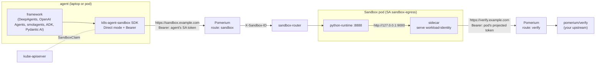

# Sandbox with an egress gateway: Pomerium and the agentops sidecar

Code that an agent runs in a sandbox usually needs to reach something outside:
an API, a model, a package index. This example gives a Sandbox exactly one way
out. The pod's network policy admits DNS and Pomerium only. A sidecar in the pod
holds the pod's projected ServiceAccount token, listens on loopback ports, and
forwards each port to one Pomerium route with that token as a Bearer. Pomerium
verifies the token as a Kubernetes JWT, applies a policy that names the
ServiceAccount, and forwards to the upstream. The code in the sandbox sees
`http://127.0.0.1:9000`, and holds no credential at all.

The agent reaches the sandbox the same way: the sandbox-router sits behind a
Pomerium route that accepts the agent's own ServiceAccount token. In the
cluster that token is projected into the agent's pod; on a laptop the developer
mints one for the same ServiceAccount.

Five Python agent frameworks drive the sandbox through the agent-sandbox Python
SDK. Each has a test that runs code in the sandbox, reaches a demo upstream
through the sidecar, and checks that the upstream saw the sandbox's identity.



The sidecar is `pomerium/agentops-sidecar` from
[pomerium/agentops](https://github.com/pomerium/agentops), run as
`sidecar serve workload-identity`. In that mode it needs no platform: a projected
token, a CA, and one `SIDECAR_HTTP_<NAME>_*` group per upstream. The repository's
kustomize Component adds it to a SandboxTemplate that carries the annotation
`agents.pomerium.com/inject: "workload"`, together with the token volume,
`automountServiceAccountToken: false` and the network policy.

## What is in here

| Path | What it is |
|---|---|
| [`sandbox/`](sandbox) | The SandboxTemplate (with the sidecar annotation), its warm pool, the sandbox's ServiceAccount, the sidecar's endpoints, the demo upstream `pomerium/verify`, and the egress route. `kubectl apply -k sandbox`. |
| [`sandbox/image/`](sandbox/image) | The sandbox image: agent-sandbox's `python-runtime-sandbox` plus `pillow`. |
| [`router/`](router) | The Pomerium route in front of the sandbox-router. |
| [`agent/`](agent) | The agent's ServiceAccount and RBAC, and a Job that runs the SDK test from inside the cluster with a projected token. |
| [`python/`](python) | The SDK helper, three adapters (smolagents, ADK, Pydantic AI), and the tests. DeepAgents and the OpenAI Agents SDK use the integrations that agent-sandbox ships. |
| [`overlays/orbstack/`](overlays/orbstack) | A tested overlay for a local OrbStack cluster with the agentops quickstart: hosts, namespaces, the mkcert CA, and a Makefile for the test loop. |

## Prerequisites

- The agent-sandbox controller with the extensions (SandboxTemplate, SandboxWarmPool, SandboxClaim), and the [sandbox-router](https://github.com/kubernetes-sigs/agent-sandbox/tree/main/sandbox-router/deploy).
- The [Pomerium Ingress Controller](https://www.pomerium.com/docs/deploy/k8s/ingress). Its configuration needs a Kubernetes identity provider that accepts the audience the sidecar presents. Pomerium allows one provider per issuer, so an existing `kubernetes:///` provider gets a second audience; a route then pins the audience it expects with `claim/aud`:

  ```yaml
  # Pomerium CR
  spec:
    identityProviders:
      cluster:
        issuer: kubernetes:///
        audiences: [pomerium-egress]      # == SIDECAR_WORKLOAD_AUDIENCE
        supportedAlgs: [RS256]
  ```

  Pomerium verifies the pod tokens through the cluster's OIDC discovery endpoint, which must be readable by it (see the Pomerium docs for the `issuerDiscoveryBinding`).
- A certificate for the two route hosts.
- Kubernetes 1.29 or later: the sidecar is a native sidecar (an init container with `restartPolicy: Always`).

## Deploy

1. Build the sandbox image and point `images:` in [`sandbox/kustomization.yaml`](sandbox/kustomization.yaml) at it. Replace the hosts `verify.example.com` and `sandbox.example.com`, and the Pomerium namespace in [`sandbox/sidecar-endpoints.yaml`](sandbox/sidecar-endpoints.yaml) (the component's network policy admits the namespace `pomerium` by default; patch it for another).
2. `kubectl apply -k sandbox`, `kubectl apply -k router`, `kubectl apply -k agent`. The agent Job needs the image from [`python/Dockerfile`](python/Dockerfile); build it or drop `job.yaml` from the kustomization.
3. Wait for the warm pool: `kubectl -n sandbox-egress get sandboxes`. The pod has two containers: `python-runtime` and the `sidecar`.

### The egress leg

[`sandbox/sandbox-template.yaml`](sandbox/sandbox-template.yaml) is an ordinary template for the python-runtime image, with one annotation. [`sandbox/sidecar-endpoints.yaml`](sandbox/sidecar-endpoints.yaml) is a name-keyed patch on the sidecar's env:

```yaml
- {name: SIDECAR_HTTP_VERIFY_PORT, value: "9000"}
- {name: SIDECAR_HTTP_VERIFY_UPSTREAM_URL, value: https://verify.example.com}
- {name: SIDECAR_HTTP_VERIFY_INJECT_RUN_TOKEN, value: "true"}
- {name: SIDECAR_HTTP_VERIFY_DIAL_ADDRESS, value: pomerium-proxy.pomerium.svc.cluster.local:443}
```

One group per upstream: a second one is `SIDECAR_HTTP_ANTHROPIC_*` on another port. `DIAL_ADDRESS` keeps the traffic in the cluster while TLS SNI and `Host` come from the URL, so the public host need not resolve inside the pod.

[`sandbox/route-verify.yaml`](sandbox/route-verify.yaml) is the route. It accepts the pod's token as a plain JWT, admits only the sandbox's ServiceAccount with the egress audience, and strips the token before forwarding, because Pomerium otherwise passes a verified Bearer on to the upstream:

```yaml
ingress.pomerium.io/bearer_token_format: jwt
ingress.pomerium.io/identity_providers: '["cluster"]'
ingress.pomerium.io/remove_request_headers: '["Authorization"]'
ingress.pomerium.io/policy: |
  allow:
    and:
      - claim/aud: pomerium-egress
      - claim/kubernetes.io.namespace: sandbox-egress
      - claim/kubernetes.io.serviceaccount.name: sandbox-egress
```

Whoever can run a pod as `sandbox-egress` gets this egress, so the ServiceAccount is the thing to guard with RBAC. A different pool with a different ServiceAccount gets different routes.

### The ingress leg

[`router/route-sandbox.yaml`](router/route-sandbox.yaml) publishes the sandbox-router with the same kind of route, for the agent's ServiceAccount `agent`. The router strips `Authorization` itself before it forwards to a sandbox. The SDK's Direct connection mode sends the URL, the Bearer and the CA:

```python
from k8s_agent_sandbox import SandboxClient
from k8s_agent_sandbox.models import SandboxDirectConnectionConfig

client = SandboxClient(connection_config=SandboxDirectConnectionConfig(
    api_url="https://sandbox.example.com",
    extra_headers={"Authorization": f"Bearer {token}"},
    ca_cert="/etc/pomerium-ca/ca.crt",   # only for a private CA
))
sandbox = client.create_sandbox(warmpool="python-egress", namespace="sandbox-egress")
```

The SDK still creates the SandboxClaim through the Kubernetes API, so the agent also needs a kubeconfig or in-cluster credentials, and [`agent/rbac.yaml`](agent/rbac.yaml) is the Role it needs.

Where the token comes from is the only difference between the laptop and the cluster, and [`python/pomerium_sandbox/__init__.py`](python/pomerium_sandbox/__init__.py) is the whole of it:

- **In the cluster**, [`agent/job.yaml`](agent/job.yaml) projects a ServiceAccount token with audience `pomerium-egress` into the pod, and `POMERIUM_TOKEN_FILE` points at it. Kubelet replaces the file before the token expires; read it when you build a client, not once at import.
- **On a laptop**, `POMERIUM_TOKEN` holds a token for the same ServiceAccount, minted by the API server:

  ```sh
  kubectl -n sandbox-egress create token agent --audience pomerium-egress --duration 1h
  ```

  The route policy does not change between the two. With Pomerium Enterprise or Zero, a [Pomerium service account](https://www.pomerium.com/docs/capabilities/service-accounts) token works the same way (`Authorization: Bearer <token>`), and the route's policy then names that account instead of a ServiceAccount claim.

A long-lived agent process in the cluster can also skip tokens in Python altogether: give its own Deployment the `agents.pomerium.com/inject: "workload"` annotation, point one sidecar port at the sandbox route, and use `SandboxDirectConnectionConfig(api_url="http://127.0.0.1:9001")`. The sidecar then keeps the token fresh.

## The tests

Every framework test runs this inside the sandbox, through the framework's own
execution interface, and checks the JSON that comes back:

```python
import json, urllib.request
print(urllib.request.urlopen("http://127.0.0.1:9000/json", timeout=15).read().decode())
```

`pomerium/verify` answers with the identity Pomerium attached. The assertion is
on `identity.sub`, which is `cluster/system:serviceaccount:sandbox-egress:sandbox-egress`:
the sandbox's ServiceAccount, through the identity provider `cluster`. A second
test checks that a direct connection to the outside fails.

From a laptop, with the OrbStack overlay (see its [Makefile](overlays/orbstack/Makefile)):

```sh
cd overlays/orbstack
make deploy          # the overlay, with the mkcert CA and the local image
make test-local      # every framework, each in its own uv environment
make test-in-cluster # the SDK test as a Job, with a projected token
```

The frameworks disagree about the `openai` package, so [`python/pyproject.toml`](python/pyproject.toml)
declares them as mutually exclusive extras and `uv run --extra <framework>` builds
one environment per framework. An application installs one framework anyway.

Each test module also has one LLM-driven test that is skipped without an API key
(`ANTHROPIC_API_KEY`, or `OPENAI_API_KEY` for the OpenAI Agents SDK).

## The frameworks

The five are the most used Python agent frameworks that define an interface for
a sandbox to implement. Each section says what that interface is, what the
example implements, and what the test showed.

### LangChain DeepAgents

DeepAgents runs its tools against a [`BaseSandbox`](https://github.com/langchain-ai/deepagents) backend (`execute`, `upload_files`, `download_files`) and discourages its `LocalShellBackend` outside development. agent-sandbox ships that backend as [`deepagents-k8s-agent-sandbox`](https://github.com/kubernetes-sigs/agent-sandbox/tree/main/clients/integrations/deepagents), so nothing is written here: the backend takes the `SandboxClient` from above.

```python
from deepagents import create_deep_agent
from deepagents_k8s_agent_sandbox import K8sAgentSandbox
from deepagents_k8s_agent_sandbox.settings import K8sAgentSandboxSettings
from pomerium_sandbox import sandbox_client

backend = K8sAgentSandbox.from_labels_scope(
    client=sandbox_client(),
    sandbox_settings=K8sAgentSandboxSettings(warmpool="python-egress", namespace="sandbox-egress"),
    scope={"thread": thread_id},
    sandbox_api_cwd="/app",
)
agent = create_deep_agent(model=ChatAnthropic(model="claude-haiku-5-5"), backend=backend)
```

[`python/tests/test_deepagents.py`](python/tests/test_deepagents.py): `backend.execute(...)` and a `write` followed by `execute` both reach verify as the sandbox.

### OpenAI Agents SDK

The SDK's `SandboxAgent` runs its shell and patch tools in a session that a `BaseSandboxClient` provides (`create`, `resume`, `delete`) and a `BaseSandboxSession` carries (`exec`, `read`, `write`, workspace snapshots). The maintainers keep third-party providers out of tree, and agent-sandbox ships one as [`openai-agents-k8s-sandbox`](https://github.com/kubernetes-sigs/agent-sandbox/tree/main/clients/integrations/openai). Its README says it had not run against a live cluster; this example is that run.

```python
from agents import Runner
from agents.run import RunConfig
from agents.sandbox import Manifest, SandboxAgent, SandboxRunConfig
from openai_agents_k8s_sandbox import K8sSandboxClient, K8sSandboxClientOptions
from pomerium_sandbox import async_sandbox_client

run_config = RunConfig(sandbox=SandboxRunConfig(
    client=K8sSandboxClient(async_sandbox_client()),
    options=K8sSandboxClientOptions(warm_pool="python-egress", namespace="sandbox-egress"),
    manifest=Manifest(root="/app/workspace"),   # the image owns /app, not /workspace
))
result = await Runner.run(SandboxAgent(name="prober", instructions="..."), prompt, run_config=run_config)
```

[`python/tests/test_openai.py`](python/tests/test_openai.py): a session's `exec` reaches verify as the sandbox. The provider pins `openai-agents` 0.19, which is why it has its own environment.

### Hugging Face smolagents

A `CodeAgent` writes Python, and a `RemotePythonExecutor` runs it in steps that share one namespace, as the E2B, Modal and Docker executors do with a Jupyter kernel. [`python/pomerium_sandbox/frameworks/smolagents_executor.py`](python/pomerium_sandbox/frameworks/smolagents_executor.py) implements `run_code_raise_errors` on top of the SDK's `/upload` and `/execute`: it starts a small kernel process in the sandbox that executes cells from files in order and writes each result as JSON. `final_answer` and errors are reported the way the E2B executor reports them. smolagents also asks the executor to pip-install each tool's requirements; the sandbox has no route to a package index, so the executor keeps what the image already has and logs the rest. That is why the image carries `pillow`.

```python
from smolagents import CodeAgent, LiteLLMModel
from smolagents.monitoring import AgentLogger
from pomerium_sandbox import sandbox_client
from pomerium_sandbox.frameworks.smolagents_executor import AgentSandboxExecutor

sandbox = sandbox_client().create_sandbox(warmpool="python-egress", namespace="sandbox-egress")
agent = CodeAgent(
    tools=[],
    model=LiteLLMModel(model_id="anthropic/claude-haiku-5-5"),
    executor=AgentSandboxExecutor(sandbox, additional_imports=[], logger=AgentLogger()),
)
```

[`python/tests/test_smolagents.py`](python/tests/test_smolagents.py): a variable set in one cell is read in the next, and a cell reaches verify as the sandbox, with the body returned through `final_answer`.

### Google ADK

An `LlmAgent` with a `code_executor` has the code block of each model reply run through `BaseCodeExecutor.execute_code`. ADK's own executors range from an unsafe local one to containers and hosted sandboxes, and its `GkeCodeExecutor` has a sandbox mode on this SDK, through a Gateway. [`python/pomerium_sandbox/frameworks/adk_executor.py`](python/pomerium_sandbox/frameworks/adk_executor.py) is the Pomerium shape of it: it claims one sandbox on first use, uploads the input files and the code, and runs it as a script.

```python
from google.adk.agents.llm_agent import LlmAgent
from google.adk.models.anthropic_llm import AnthropicLlm
from pomerium_sandbox import sandbox_client
from pomerium_sandbox.frameworks.adk_executor import AgentSandboxCodeExecutor

executor = AgentSandboxCodeExecutor(client=sandbox_client(), warmpool="python-egress", namespace="sandbox-egress")
agent = LlmAgent(name="prober", model=AnthropicLlm(model="claude-haiku-5-5"), code_executor=executor)
```

[`python/tests/test_adk.py`](python/tests/test_adk.py): `execute_code` reaches verify as the sandbox, and an input file is readable by the code.

### Pydantic AI

Pydantic AI's tools work in a `Workspace` over a `WorkspaceBackend`: `ref` and `working_dir`, plus `SupportsCommands` and optionally `SupportsFilesystem`. It documents a contract for third-party backends and ships a conformance suite for it. [`python/pomerium_sandbox/frameworks/pydantic_ai_workspace.py`](python/pomerium_sandbox/frameworks/pydantic_ai_workspace.py) implements commands only; Pydantic AI derives the file operations through the sandbox's shell. The first operation claims a sandbox or attaches to the one a ref names; a cancelled command is killed inside the sandbox; a sandbox that disappears raises `WorkspaceUnavailableError`.

```python
from pydantic_ai import Agent
from pydantic_ai.workspaces import Workspace
from pomerium_sandbox import sandbox_client
from pomerium_sandbox.frameworks.pydantic_ai_workspace import AgentSandboxWorkspace

workspace = Workspace(AgentSandboxWorkspace(sandbox_client(), warmpool="python-egress", namespace="sandbox-egress"))
result = await workspace.run("python3 probe.py", shell=True)
```

[`python/tests/test_pydantic_ai.py`](python/tests/test_pydantic_ai.py) runs Pydantic AI's `WorkspaceBackendSuite` against it: 37 rules pass. Two describe the runtime image rather than the backend and are declared: its `/execute` endpoint decodes output strictly instead of replacing undecodable bytes, and it reports a command's exit only after every process holding its output has exited.

### Not included

CrewAI removed its code interpreter in 1.14 and points at vendor sandbox tools (E2B, Daytona); a `BaseTool` that calls the SDK is ordinary tool code, not a sandbox interface. AutoGen has a `CodeExecutor` interface but is in maintenance mode; its successor, Microsoft Agent Framework, uses hosted code interpreters and a Docker shell tool. LlamaIndex and the Claude Agent SDK have no interface for a sandbox provider.

## Limits

- The SDK copies `extra_headers` when the client is built. A process that outlives a projected token's lifetime (one hour in [`agent/job.yaml`](agent/job.yaml)) builds a new client, or runs the sidecar itself as described above.
- The sandbox-router's `--proxy-timeout` (180 s) and the route's `timeout` bound one command.
- The sandbox reaches a package index only through a Pomerium route of its own. Put what the agent's code needs in the image.
