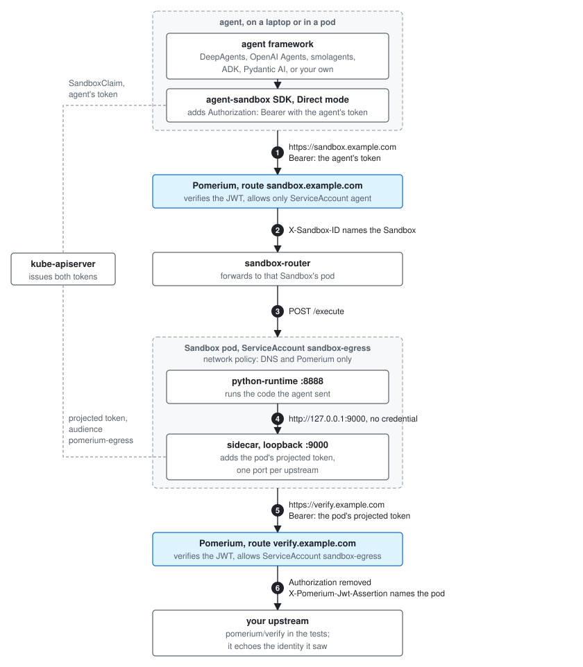

# Sandbox with an egress gateway

This example runs an
[agent-sandbox](https://github.com/kubernetes-sigs/agent-sandbox) Sandbox whose
outbound traffic goes through [Pomerium](https://www.pomerium.com), an
identity-aware proxy. The pod's network policy allows DNS and Pomerium and
nothing else. A sidecar in the pod listens on loopback ports and forwards each
one to a Pomerium route, adding the pod's projected ServiceAccount token as a
Bearer. Pomerium verifies the token as a Kubernetes JWT, applies a policy that
names the ServiceAccount, and forwards the request. Code in the sandbox talks
to `http://127.0.0.1:9000` and never sees a credential.

The agent reaches the sandbox the same way. agent-sandbox's sandbox-router is
behind a Pomerium route that accepts the agent's ServiceAccount token: a
projected token in the cluster, or a token minted with `kubectl create token`
on a laptop.

The tests show the same thing from a few agent frameworks:
[LangChain DeepAgents](#langchain-deepagents), the
[OpenAI Agents SDK](#openai-agents-sdk), [smolagents](#smolagents),
[Google ADK](#google-adk) and [Pydantic AI](#pydantic-ai). Each one runs code in
the sandbox through its own sandbox interface and checks that the upstream saw
the sandbox's identity. Nothing here is specific to them, or to Python. The
sandbox is reached over HTTP with a Bearer token and the agent-sandbox SDK or
its Go client, so a framework in another language plugs in the same way.

- [How it works](#how-it-works)
- [Files](#files)
- [Prerequisites](#prerequisites)
- [Deploy](#deploy)
- [The egress route](#the-egress-route)
- [The sandbox route](#the-sandbox-route)
- [Tests](#tests)
- [Frameworks](#frameworks)
  - [LangChain DeepAgents](#langchain-deepagents)
  - [OpenAI Agents SDK](#openai-agents-sdk)
  - [smolagents](#smolagents)
  - [Google ADK](#google-adk)
  - [Pydantic AI](#pydantic-ai)
  - [Not included](#not-included)
- [Limits](#limits)

## How it works



Two things are checked twice: who is calling, and whether that caller may
reach this route. The agent's request carries the agent's ServiceAccount
token. The sandbox's request carries the pod's. Each is a JWT signed by the
cluster, and Pomerium verifies it against the cluster's OIDC discovery
endpoint, the same way it would verify a login from an identity provider. A
route's policy then matches the token's claims: audience, namespace, and
ServiceAccount name. Open-source Pomerium does all of this; the routes only
set `bearer_token_format: jwt`.

The sidecar is a small HTTP proxy, `pomerium/agentops-sidecar` from
[pomerium/agentops](https://github.com/pomerium/agentops), started as
`sidecar serve workload-identity`. Each group of `SIDECAR_HTTP_<NAME>_*`
variables opens one loopback port and names the upstream behind it. The
sidecar reads the pod's projected token from a file and adds it to every
request it forwards. A kustomize Component from the same repo adds the sidecar
to any SandboxTemplate annotated `agents.pomerium.com/inject: "workload"`,
along with the token volume, `automountServiceAccountToken: false`, and the
network policy.

## Files

| Path | Contents |
|---|---|
| [`sandbox/`](sandbox) | The SandboxTemplate, its warm pool, the sandbox's ServiceAccount, the sidecar endpoints, the demo upstream (`pomerium/verify`), and the egress route. |
| [`sandbox/image/`](sandbox/image) | The sandbox image: agent-sandbox's `python-runtime-sandbox` plus `pillow`. |
| [`router/`](router) | The Pomerium route in front of the sandbox-router. |
| [`agent/`](agent) | The agent's ServiceAccount and RBAC, and a Job that runs the SDK test in the cluster with a projected token. |
| [`python/`](python) | The SDK helper, adapters for smolagents, ADK and Pydantic AI, and the tests. DeepAgents and the OpenAI Agents SDK use integrations that agent-sandbox already ships. |

## Prerequisites

- The agent-sandbox controller with the extensions (SandboxTemplate, SandboxWarmPool, SandboxClaim), and the [sandbox-router](https://github.com/kubernetes-sigs/agent-sandbox/tree/main/sandbox-router/deploy).
- The [Pomerium Ingress Controller](https://www.pomerium.com/docs/deploy/k8s/ingress), configured with a Kubernetes identity provider that lists the sidecar's audience. Pomerium allows one identity provider per issuer, so if a `kubernetes:///` provider already exists, add the audience to it. Routes pin the audience they expect with `claim/aud`.

  ```yaml
  # Pomerium CR
  spec:
    identityProviders:
      cluster:
        issuer: kubernetes:///
        audiences: [pomerium-egress]      # == SIDECAR_WORKLOAD_AUDIENCE
        supportedAlgs: [RS256]
  ```

  Pomerium verifies pod tokens through the cluster's OIDC discovery endpoint, so that endpoint must be readable by Pomerium. See the Pomerium docs for `issuerDiscoveryBinding`.
- A certificate for the two route hosts.
- Kubernetes 1.29 or later. The sidecar is a native sidecar: an init container with `restartPolicy: Always`.

## Deploy

1. Build [`sandbox/image`](sandbox/image), push it, and point `images:` in [`sandbox/kustomization.yaml`](sandbox/kustomization.yaml) at it. Replace the hosts `verify.example.com` and `sandbox.example.com`. If Pomerium is not in the namespace `pomerium`, patch the namespace in the sidecar's `DIAL_ADDRESS` and in the Component's network policy.
2. Apply the three kustomizations:

   ```sh
   kubectl apply -k sandbox
   kubectl apply -k router
   kubectl apply -k agent
   ```

   The agent Job uses the image from [`python/Dockerfile`](python/Dockerfile). Build it, or remove `job.yaml` from the kustomization.
3. Wait for the warm pool: `kubectl -n sandbox-egress get sandboxes`. The pod has two containers, `python-runtime` and `sidecar`.

## The egress route

[`sandbox/sandbox-template.yaml`](sandbox/sandbox-template.yaml) is an
ordinary SandboxTemplate for the python-runtime image, with the
`agents.pomerium.com/inject` annotation added.
[`sandbox/sidecar-endpoints.yaml`](sandbox/sidecar-endpoints.yaml) patches the
sidecar's environment; kustomize merges the entries by name:

```yaml
- {name: SIDECAR_HTTP_VERIFY_PORT, value: "9000"}
- {name: SIDECAR_HTTP_VERIFY_UPSTREAM_URL, value: https://verify.example.com}
- {name: SIDECAR_HTTP_VERIFY_INJECT_RUN_TOKEN, value: "true"}
- {name: SIDECAR_HTTP_VERIFY_DIAL_ADDRESS, value: pomerium-proxy.pomerium.svc.cluster.local:443}
```

Each upstream is one such group on its own port; for example
`SIDECAR_HTTP_ANTHROPIC_*` on 9999. The sidecar connects to `DIAL_ADDRESS`,
the Pomerium Service inside the cluster, but takes the TLS server name and the
`Host` header from the URL, so the public host does not have to resolve inside
the pod.

[`sandbox/route-verify.yaml`](sandbox/route-verify.yaml) is the route. It
accepts the pod's token as a JWT, allows only the sandbox's ServiceAccount with
the egress audience, and removes the token before forwarding. Without that last
annotation Pomerium would pass the verified token on to the upstream.

```yaml
ingress.pomerium.io/bearer_token_format: jwt
ingress.pomerium.io/identity_providers: '["cluster"]'
ingress.pomerium.io/remove_request_headers: '["Authorization"]'
ingress.pomerium.io/policy: |
  allow:
    and:
      - claim/aud: pomerium-egress
      - claim/kubernetes.io.namespace: sandbox-egress
      - claim/kubernetes.io.serviceaccount.name: sandbox-egress
```

Any pod that runs as `sandbox-egress` gets this egress, so RBAC over that
ServiceAccount decides who gets it. A pool with a different ServiceAccount can
have different routes.

## The sandbox route

[`router/route-sandbox.yaml`](router/route-sandbox.yaml) is the same kind of
route in front of the sandbox-router, for the agent's ServiceAccount `agent`.
The router removes `Authorization` itself before forwarding to a sandbox.

The SDK's Direct connection mode takes the URL, the Bearer, and the CA:

```python
from k8s_agent_sandbox import SandboxClient
from k8s_agent_sandbox.models import SandboxDirectConnectionConfig

client = SandboxClient(connection_config=SandboxDirectConnectionConfig(
    api_url="https://sandbox.example.com",
    extra_headers={"Authorization": f"Bearer {token}"},
    ca_cert="/etc/pomerium-ca/ca.crt",   # only for a private CA
))
sandbox = client.create_sandbox(warmpool="python-egress", namespace="sandbox-egress")
```

The SDK creates the SandboxClaim through the Kubernetes API, so the agent also
needs a kubeconfig or in-cluster credentials. [`agent/rbac.yaml`](agent/rbac.yaml)
is the Role it needs.

The only difference between a laptop and a pod is where the token comes from.
[`python/pomerium_sandbox/__init__.py`](python/pomerium_sandbox/__init__.py)
handles both:

- In the cluster, [`agent/job.yaml`](agent/job.yaml) projects a ServiceAccount
  token with audience `pomerium-egress` into the pod, and `POMERIUM_TOKEN_FILE`
  names the file. Kubelet rewrites the file before the token expires, so read it
  when building a client, not at import time.
- On a laptop, `POMERIUM_TOKEN` holds a token for the same ServiceAccount:

  ```sh
  kubectl -n sandbox-egress create token agent --audience pomerium-egress --duration 1h
  ```

The route policy is the same in both cases. With Pomerium Enterprise or Zero, a
[Pomerium service account](https://www.pomerium.com/docs/capabilities/service-accounts)
token also works as the Bearer; the policy then names that account instead of
a ServiceAccount claim.

A long-running agent in the cluster can avoid handling tokens in Python. Give
its Deployment the `agents.pomerium.com/inject: "workload"` annotation, point
one sidecar port at the sandbox route, and use
`SandboxDirectConnectionConfig(api_url="http://127.0.0.1:9001")`. The sidecar
keeps the token current.

## Tests

Every framework test runs this inside the sandbox, through the framework's
execution interface:

```python
import json, urllib.request
print(urllib.request.urlopen("http://127.0.0.1:9000/json", timeout=15).read().decode())
```

`pomerium/verify` returns the identity Pomerium attached. The tests check that
`identity.sub` is `cluster/system:serviceaccount:sandbox-egress:sandbox-egress`:
the sandbox's ServiceAccount, via the identity provider `cluster`. One more test
checks that a direct connection to the outside fails.

The tests read their settings from the environment:

| Variable | Meaning |
|---|---|
| `SANDBOX_API_URL` | The Pomerium route in front of the sandbox-router. |
| `POMERIUM_TOKEN` or `POMERIUM_TOKEN_FILE` | The Bearer, or the file that holds it. |
| `POMERIUM_CA_CERT` | The CA bundle, if Pomerium presents a private CA. |
| `SANDBOX_NAMESPACE`, `SANDBOX_WARMPOOL` | Where claims go and which pool serves them. Default `sandbox-egress`, `python-egress`. |

The frameworks need different versions of the `openai` package, so
[`python/pyproject.toml`](python/pyproject.toml) declares them as mutually
exclusive extras, and `uv run --extra <framework>` builds an environment for
one framework at a time:

```sh
cd python
uv run --extra test pytest tests/test_sdk.py
uv run --extra test --extra pydantic-ai pytest tests/test_pydantic_ai.py
```

[`agent/job.yaml`](agent/job.yaml) runs the SDK test in the cluster, with the
projected token as the Bearer.

Each test module also has one test that drives an LLM. It is skipped without
`ANTHROPIC_API_KEY` (`OPENAI_API_KEY` for the OpenAI Agents SDK).

## Frameworks

Each section describes the framework's sandbox interface, the code here, and
the test.

### LangChain DeepAgents

DeepAgents runs its tools against a [`BaseSandbox`](https://github.com/langchain-ai/deepagents)
backend (`execute`, `upload_files`, `download_files`) and warns against its
`LocalShellBackend` outside development. agent-sandbox ships this backend as
[`deepagents-k8s-agent-sandbox`](https://github.com/kubernetes-sigs/agent-sandbox/tree/main/clients/integrations/deepagents).
It takes the `SandboxClient` from above as is.

```python
from deepagents import create_deep_agent
from deepagents_k8s_agent_sandbox import K8sAgentSandbox
from deepagents_k8s_agent_sandbox.settings import K8sAgentSandboxSettings
from pomerium_sandbox import sandbox_client

backend = K8sAgentSandbox.from_labels_scope(
    client=sandbox_client(),
    sandbox_settings=K8sAgentSandboxSettings(warmpool="python-egress", namespace="sandbox-egress"),
    scope={"thread": thread_id},
    sandbox_api_cwd="/app",
)
agent = create_deep_agent(model=ChatAnthropic(model="claude-haiku-5-5"), backend=backend)
```

[`python/tests/test_deepagents.py`](python/tests/test_deepagents.py) checks
`backend.execute(...)`, and `write` followed by `execute`.

### OpenAI Agents SDK

A `SandboxAgent` runs its shell and patch tools in a session. A provider
implements `BaseSandboxClient` (`create`, `resume`, `delete`) and
`BaseSandboxSession` (`exec`, `read`, `write`, workspace snapshots). The SDK
does not take third-party providers in tree; agent-sandbox ships one as
[`openai-agents-k8s-sandbox`](https://github.com/kubernetes-sigs/agent-sandbox/tree/main/clients/integrations/openai).
Its README says it had not been run against a cluster. It works here, with
the manifest root moved to a writable directory.

```python
from agents import Runner
from agents.run import RunConfig
from agents.sandbox import Manifest, SandboxAgent, SandboxRunConfig
from openai_agents_k8s_sandbox import K8sSandboxClient, K8sSandboxClientOptions
from pomerium_sandbox import async_sandbox_client

run_config = RunConfig(sandbox=SandboxRunConfig(
    client=K8sSandboxClient(async_sandbox_client()),
    options=K8sSandboxClientOptions(warm_pool="python-egress", namespace="sandbox-egress"),
    manifest=Manifest(root="/app/workspace"),   # the image owns /app, not /workspace
))
result = await Runner.run(SandboxAgent(name="prober", instructions="..."), prompt, run_config=run_config)
```

[`python/tests/test_openai.py`](python/tests/test_openai.py) checks a session's
`exec`. The provider pins `openai-agents` 0.19, which is why it needs its own
environment.

### smolagents

A `CodeAgent` writes Python and a `RemotePythonExecutor` runs it, one step at a
time, in a namespace that persists across steps. The E2B, Modal and Docker
executors use a Jupyter kernel for this.
[`smolagents_executor.py`](python/pomerium_sandbox/frameworks/smolagents_executor.py)
implements `run_code_raise_errors` over the SDK's `/upload` and `/execute`. It
starts a small kernel process in the sandbox that executes cells from files, in
order, and writes each result as JSON. `final_answer` and errors are reported
the way the E2B executor reports them.

smolagents asks the executor to pip-install each tool's requirements. The
sandbox has no route to a package index, so the executor checks that each
package imports and logs the ones that do not. The `final_answer` tool imports `PIL` at
module level, which is why the image includes `pillow`.

```python
from smolagents import CodeAgent, LiteLLMModel
from smolagents.monitoring import AgentLogger
from pomerium_sandbox import sandbox_client
from pomerium_sandbox.frameworks.smolagents_executor import AgentSandboxExecutor

sandbox = sandbox_client().create_sandbox(warmpool="python-egress", namespace="sandbox-egress")
agent = CodeAgent(
    tools=[],
    model=LiteLLMModel(model_id="anthropic/claude-haiku-5-5"),
    executor=AgentSandboxExecutor(sandbox, additional_imports=[], logger=AgentLogger()),
)
```

[`python/tests/test_smolagents.py`](python/tests/test_smolagents.py) checks
that a variable set in one cell is visible in the next, and that a cell's
result comes back through `final_answer`.

### Google ADK

An `LlmAgent` with a `code_executor` passes the code block from each model
reply to `BaseCodeExecutor.execute_code`. ADK ships executors for local
execution, containers, and hosted sandboxes; its `GkeCodeExecutor` has a
sandbox mode that uses this SDK through a Gateway.
[`adk_executor.py`](python/pomerium_sandbox/frameworks/adk_executor.py) does
the same through Pomerium. It claims one sandbox on first use, uploads the
input files and the code, and runs the code as a script.

```python
from google.adk.agents.llm_agent import LlmAgent
from google.adk.models.anthropic_llm import AnthropicLlm
from pomerium_sandbox import sandbox_client
from pomerium_sandbox.frameworks.adk_executor import AgentSandboxCodeExecutor

executor = AgentSandboxCodeExecutor(client=sandbox_client(), warmpool="python-egress", namespace="sandbox-egress")
agent = LlmAgent(name="prober", model=AnthropicLlm(model="claude-haiku-5-5"), code_executor=executor)
```

[`python/tests/test_adk.py`](python/tests/test_adk.py) checks `execute_code`
and that an input file is readable by the code.

### Pydantic AI

Pydantic AI tools work in a `Workspace` over a `WorkspaceBackend`: `ref` and
`working_dir`, plus `SupportsCommands` and optionally `SupportsFilesystem`. The
contract for backends is documented, and there is a conformance suite.
[`pydantic_ai_workspace.py`](python/pomerium_sandbox/frameworks/pydantic_ai_workspace.py)
implements commands only; Pydantic AI derives file operations through the
sandbox's shell. The first operation claims a sandbox, or attaches to the one a
ref names. A cancelled command is killed in the sandbox. A sandbox that
disappears raises `WorkspaceUnavailableError`.

```python
from pydantic_ai import Agent
from pydantic_ai.workspaces import Workspace
from pomerium_sandbox import sandbox_client
from pomerium_sandbox.frameworks.pydantic_ai_workspace import AgentSandboxWorkspace

workspace = Workspace(AgentSandboxWorkspace(sandbox_client(), warmpool="python-egress", namespace="sandbox-egress"))
result = await workspace.run("python3 probe.py", shell=True)
```

[`python/tests/test_pydantic_ai.py`](python/tests/test_pydantic_ai.py) runs
Pydantic AI's `WorkspaceBackendSuite`: 37 rules pass. Two rules describe the
runtime image rather than the backend, and the test file declares them. The
image's `/execute` decodes output strictly instead of replacing undecodable
bytes, and it reports a command's exit only after every process holding its
output has exited.

### Not included

CrewAI removed its code interpreter in 1.14 and points at vendor tools (E2B,
Daytona). A `BaseTool` that calls the SDK is an ordinary tool, not a sandbox
interface. AutoGen has a `CodeExecutor` interface but is in maintenance mode;
its successor, Microsoft Agent Framework, uses hosted code interpreters and a
Docker shell tool. LlamaIndex and the Claude Agent SDK have no interface for a
sandbox provider.

## Limits

- The SDK copies `extra_headers` when the client is built. A process that
  outlives a projected token (one hour in [`agent/job.yaml`](agent/job.yaml))
  must build a new client, or run the sidecar itself as described above.
- One command is bounded by the sandbox-router's `--proxy-timeout` (180s) and
  the route's `timeout`.
- The sandbox reaches a package index only through a Pomerium route. Put what
  the agent's code needs in the image.
